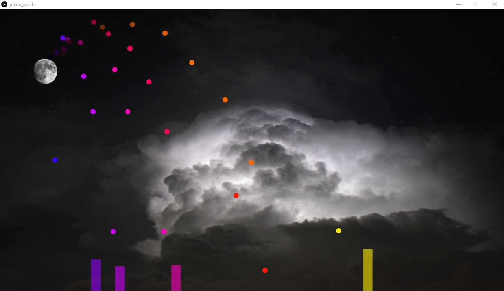

# piano_synth

My attempt at creating a colorful visualization of common .midi files.  A cannon launches colorful balls which land on note timings.  The horizontal position of the landing spot represents the pitch of the note, while the height of the corresponding bar that appears corresponds to the volume of the note. Look [https://www.youtube.com/watch?v=FQs-HAAVmhs](here) for an example.

# Requirements
* Python 3.6
* mido 1.2.8
* Processing 3.5.4

# Usage

* Place midi file in the data/MidiFiles folder.

* Open up `midi_converter.py'

    * Change the `midifilename` variable to match the .midi file

    * Change the `outputfilename` variable to match the song title

* Run the script

* Open the processing script `piano_synth`

    * Change the `midifilename` variable to match the .midi file
    * Change the `notefilename` variable to match the newly created .csv file from the python script

* Run the program

# Notes
Not all .midi files work, tracks with multiple instruments and older files tend to fail
